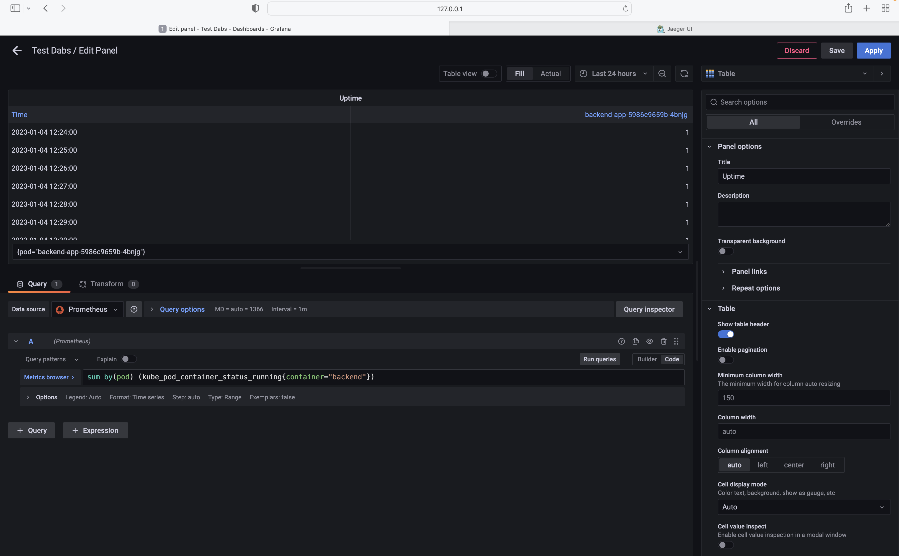

**Note:** For the screenshots, you can store all of your answer images in the `answer-img` directory.

## Verify the monitoring installation
kubectl get po,svc -n monitoring
screenshot path:

## Setup the Jaeger and Prometheus source
Create “all-in-one” Jaeger instance - When you have the Jaeger Operator deployed in the observability namespace, create a Jaeger instance:

kubectl apply -n observability -f - <<EOF
apiVersion: jaegertracing.io/v1
kind: Jaeger
metadata:
 name: simplest
EOF

## Create a Basic Dashboard

## Describe SLO/SLI
SLO are the promises that you make to your customer. It should be mesurable and comes with specific metric like Response Time, Uptime etc. For example you promise your customer to keep the service uptime as 99.99% or response time as 2 ms for 99.95% of the time.
SLI is the actual percentage for a given period of time. Your service might be up for 99.95% of the time against your SLO as 99.99%.

## Creating SLI metrics.
It is important to know why we want to measure certain metrics for our customer. Describe in detail 5 metrics to measure these SLIs. 
Below are different SLIs
Latency: Response time of a service.
Error rate: Out of N response, how many of them are 50x.
Uptime: out of x hours, how long service is up and healthy.
Saturation: Resource utlization like memory or CPU utilization.
Network bandwidth:indicates the average bandwidth in a specifi period of time

## Create a Dashboard to measure our SLIs
Create a dashboard to measure the uptime of the frontend and backend services We will also want to measure to measure 40x and 50x errors. Create a dashboard that show these values over a 24 hour period and take a screenshot

## Tracing our Flask App

We will create a Jaeger span to measure the processes on the backend. Once you fill in the span, provide a screenshot of it here. Also provide a (screenshot) sample Python file containing a trace and span code used to perform Jaeger traces on the backend service.

## Jaeger in Dashboards
Now that the trace is running, let's add the metric to our current Grafana dashboard. Once this is completed, provide a screenshot of it here.

## Report Error

TROUBLE TICKET
Name: /error endpoint is not working
Date:1/5/2023
Subject: throwing 500 internal error
Affected Area: /error endpoint handler is not handling null exception

Severity: Medium
Description: /error endpint is accepting a field which is optional and sometime it holds null value but doesnt have the null check and hence it throws 500 internal error.

## Creating SLIs and SLOs
We want to create an SLO guaranteeing that our application has a 99.95% uptime per month. Name four SLIs that you would use to measure the success of this SLO.

Latency: Response time of a service.
Error rate: Out of N response, how many of them are 50x.
Uptime: out of x hours, how long service is up and healthy.
Saturation: Resource utlization like memory or CPU utilization.

## Building KPIs for our plan
Now that we have our SLIs and SLOs, create a list of 2-3 KPIs to accurately measure these metrics as well as a description of why those KPIs were chosen. We will make a dashboard for this, but first write them down here.

Error rate: User experience is very important and hence we need to make sure the error rate should be within the expected range which will be 1% or less.

Saturation: Performance is next big factor which helps also in better user experince and overall productivity. It should be within limit 99.95% of the time.

## Final Dashboard

Error(SLO:Less than 1%). SLI  Its >10% in the given pie chart which is not as per SLO defined.
Saturation(99.95%): SLI is 100% as all the resources are consumed with a limit. 
